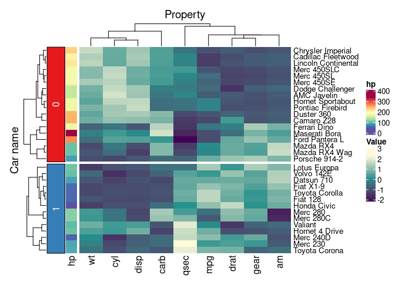
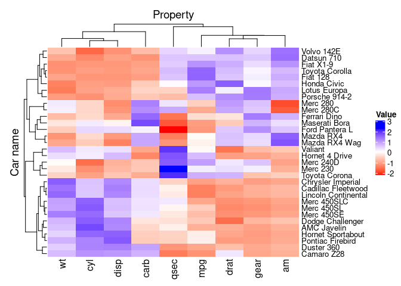
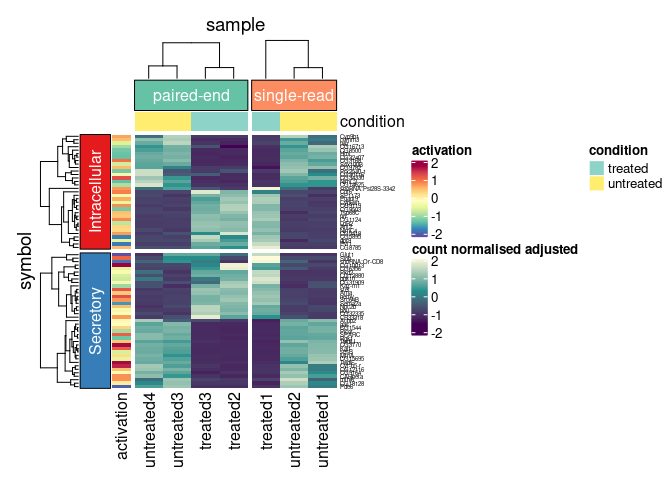

tidyHeatmap
================

(If you like tidyverse and RNA, try
[tidybulk](https://github.com/stemangiola/tidybulk) for tidy and modular
transcriptomics analyses\!)

<!-- badges: start -->

[](https://www.tidyverse.org/lifecycle/#maturing)
<!-- badges: end -->

Tidy heatmap. This package is a tidy wrapper of the package
[ComplexHeatmap](https://bioconductor.org/packages/release/bioc/html/ComplexHeatmap.html).
The goal of this package is to interface tidy data frames with this
powerful tool.

Some of the advantages are:

  - Row and/or columns colour annotations are easy to integrate just
    specifying one parameter (column names).
  - Custom grouping of rows is easy to specify providing a grouped tbl.
    For example `df %>% group_by(...)`
  - Labels size adjusted by row and column total number
  - Default use of Brewer and Viridis palettes

## Installation

To install the most up-to-date version

``` r
devtools::install_github("stemangiola/tidyHeatmap")
```

To install the most stable version (however please keep in mind that
this package is under a maturing lifecycle stage)

``` r
install.packages("tidyHeatmap")
```

## Input data frame

``` r
mtcars_tidy = 
    mtcars %>% 
    as_tibble(rownames="Car name") %>% 
    
    # Scale
    mutate_at(vars(-`Car name`, -hp, -vs), scale) %>%
    
    # tidyfy
    gather(Property, Value, -`Car name`, -hp, -vs)

mtcars_tidy
```

    ## # A tibble: 288 x 5
    ##    `Car name`           hp    vs Property  Value
    ##    <chr>             <dbl> <dbl> <chr>     <dbl>
    ##  1 Mazda RX4           110     0 mpg       0.151
    ##  2 Mazda RX4 Wag       110     0 mpg       0.151
    ##  3 Datsun 710           93     1 mpg       0.450
    ##  4 Hornet 4 Drive      110     1 mpg       0.217
    ##  5 Hornet Sportabout   175     0 mpg      -0.231
    ##  6 Valiant             105     1 mpg      -0.330
    ##  7 Duster 360          245     0 mpg      -0.961
    ##  8 Merc 240D            62     1 mpg       0.715
    ##  9 Merc 230             95     1 mpg       0.450
    ## 10 Merc 280            123     1 mpg      -0.148
    ## # … with 278 more rows

## Plot

For plotting, you simply pipe the input data frame into heatmap,
specifying:

  - The rows, cols relative column names (mandatory)
  - The value column name (mandatory)
  - The annotations column name(s)

mtcars

``` r
mtcars_tidy %>% 
    heatmap(
        `Car name`, 
        Property, 
        Value,
        annotation = hp
    )
```

<!-- -->

## Grouping

We can easily group the data (one group per dimension maximum, at the
moment only the vertical dimension is supported) with dplyr, and the
heatmap will be grouped accordingly

``` r
mtcars_tidy %>% 
    group_by(vs) %>%
    heatmap(
        `Car name`, 
        Property, 
        Value,
        annotation = hp
    )
```

<!-- -->

## Custom palettes

We can easily use custom palette, using strings, hexadecimal color
character vector,

``` r
mtcars_tidy %>% 
    heatmap(
        `Car name`, 
        Property, 
        Value,
        palette_value = c("red", "white", "blue")
    )
```

<!-- -->

Or a grid::colorRamp2 functionfor higher flexibility

``` r
mtcars_tidy %>% 
    heatmap(
        `Car name`, 
        Property, 
        Value,
        palette_value = circlize::colorRamp2(c(-2, -1, 0, 1, 2), viridis::magma(5))
    )
```

<!-- -->

## Multiple groupings and annotations

``` r
tidyHeatmap::pasilla %>%
    group_by(location, type) %>%
    heatmap(
            .column = sample,
            .row = symbol,
            .value = `count normalised adjusted`,
            annotation = c(condition, activation)
        )
```

<!-- -->

## Annotation types

**This features requires \>= 0.99.20 version** “tile” (default),
“point”, “bar” and “line” are available

``` r
# Chreate some more data points
pasilla_plus = 
    tidyHeatmap::pasilla %>%
        dplyr::mutate(act = activation) %>% 
        tidyr::nest(data = -sample) %>%
        dplyr::mutate(size = rnorm(n(), 4,0.5)) %>%
        dplyr::mutate(age = runif(n(), 50, 200)) %>%
        tidyr::unnest(data) 

# Plot
pasilla_plus %>%
        heatmap(
            .column = sample,
            .row = symbol,
            .value = `count normalised adjusted`,
            annotation = c(condition, activation, act, size, age),
            type = c("tile", "point", "tile", "bar", "line")
        )
```

<!-- -->
