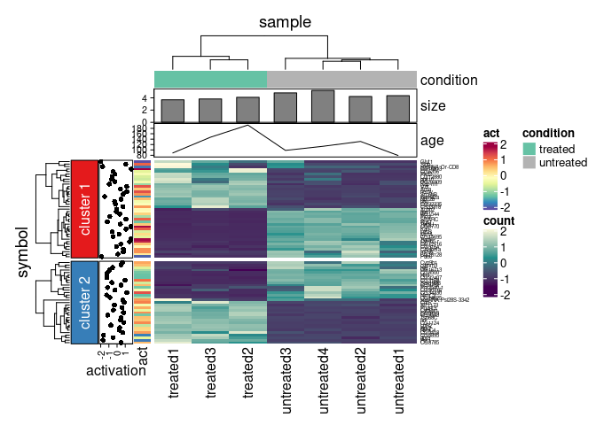

---
title: 'tidyHeatmap: A modular and tidyverse-style R package for heatmap visualisation'
tags:
  - R
  - tidyverse
  - tidy
  - heatmap
  - data visualization
authors:
  - name: Stefano Mangiola^[Corresponding author]
    orcid: 0000-0001-7474-836X
    affiliation: "1, 2" 
  - name: Anthony T. Papenfuss
    orcid: 0000-0002-1102-8506
    affiliation: "1, 2, 3, 4" 
affiliations:
 - name: Bioinformatics Division, The Walter and Eliza Hall Institute of Medical Research, Parkville, Victoria, Australia
   index: 1
 - name: Department of Medical Biology, University of Melbourne, Melbourne, Victoria, Australia.
   index: 2
 - name: Peter MacCallum Cancer Centre, Melbourne, VIC 3000, Australia.
   index: 3
 - name: School of Mathematics and Statistics, University of Melbourne, Melbourne, VIC 3010, Australia.
   index: 4
date: 07 July 2020
bibliography: paper.bib

# Summary

Heatmap is a powerful tool to visualise multi-dimensional data, where individual values can be organised in a two-dimensional matrix and their values expressed as colors. Row and columns can be ordered accordingly to their reciprocal similarity, using hierarchical clustering; and dendrograms can be added to the plot to facilitate the interpretation. Row- and column-wise can have associated visual annotations, such as colored tiles. Within the R environment, several packages have been produced to facilitate the production of heatmaps. The most simple and readily available tool is provided within the `stats` package [@R Core Team:2013], which offers basic heatmaps with no annotations. The versative package `ggplot2` gives the possibility to produce basic heatmaps, but with fine aesthetical adjustable parameters [REF]. More powerful software exist for producing fully annotated, multi-panels heatmaps, such as `ComplexHeatmap` [Complex Heatmaps Reveal Patterns and Correlations in Multidimensional Genomic Data] and `Pheatmap` [REF]. The versatility of these packages comes at the cost of adding complexity in the user interface, characterised by a arge number of parameters and annotation functions that introduce a steap learning curve for producing complex, clear and good looking graphics.

Recently, efforts have been made toward the harmonisation of data frame structures and data analysis workflows using the concept of tidiness [4]. Tidy data frames allow ease of manipulation, modelling and visualisation; and are characterised by having a specific structure where each variable is a column and each observation is a row. The `tidyverse` is a suite that defined the standard for tidy data and APIs [REF]. As the correspondence between quantities and annotations are univoquely defined in tidy data frames, a large portion of the information matching needed for highly annotated and structured heatmaps can be done programmatically, increasing user the cost/benefit ratio in complex operations. Within this basis, often the user input is limited to column names, of a tidy data frame.
 
`tidyHeatmap` is a graphical R package that introduces tidy principles to the creation of information-rich heatmaps. It is part of the CRAN R repository [REF]. This package uses `ComplexHeatmap` as graphical engine. The command-line user interface is organised in (i) the main plotting utility; (ii) the annotation layer utilities; and (iii) the save-to-disk utilities. The inputdata frame streams along the utility path using the pipe operator from `magrittr`, allowing high level of modularity. The main utility allows the user to plot a base heatmap with dendrograms. The annotation utilities allow to serially add tile, point, bar and/or line annotation boxes to the side on the heatmap. The orientation of the annotations (row- or column-wise) is inferred by the `tidyHeatmap` algorithms, based on the input data frame. The save-to-disk utility allows to create vectorial or bitmap images directly from the R object, in the style of `ggplot2`. User defined row- or column-wise clusters can be defined effortlessy applying `group_by` function from `dplyr` [REF] to the input data frame. Beside offering a modular and user-friendly interface, `tidyHeatmap` provide publication ready aesthetics such as viridis [REF] and brewer [REF] color palettes and automatic sizing of row and column labels to avoid overlapping.    

# Code interface

The input is a tidy data frame with the three basic columns including row and column elements of the heatmap and values, that will be converted in colors. Additionally further columns can include information about grouping and annotation.

| element         | feature         | value     | annotation | group |
| --------------- | --------------- | --------- | ---------- | ----- |
| `chr` or `fctr` | `chr` or `fctr` | `numeric` | …          | …     |


The code interface consist in modular functions linked through the pipe operator (\autoref{fig:example}). Custom color palette can be used passing an array of colors of a color function (e.g., circlize [REF]) to the palette argument of the annotation utilities.

```r
my_heatmap = 

		# Grouping
		input_df %>%
		group_by(location) %>%
		
		# Plotting
    heatmap(feature, element, value) %>%
    
    # Annotation
    add_tile(condition) %>%
    add_tile(act) %>%
    add_point(activation) %>%
    add_bar(size) %>%
    add_line(age)

# Saving
my_heatmap %>% save_pdf("my_file.pdf")
```

For comparative purposes, the instructions using `ComplexHeatmap` needed to achieve \autoref{fig:example} require 56 lines of code and 1309 characters (compared with 18 and 239 characters using `tidyHeatmap`).

```r
# Heatmap coloring
palette_abundance = c("#440154FF", "#21908CFF", "#fefada" )
colors = 
  colorRamp2(
    palette_abundance
    seq(from=min(value_matrix), to=max(value_matrix), length.out = length(palette_abundance)),
    palette_abundance
  )

# Column annotations
col_df = col_df[match(colnames(value_matrix), rownames(col_df)),]
top_annot = HeatmapAnnotation(
    condition = col_df$condition, 
    size = anno_bar(col_df$size),
    age = anno_lines(col_df$age),
    col = list(condition = c("#...", "#..."))
)

# Row annotations
row_df = row_df[match(rownames(value_matrix), rownames(row_df)),]
color_act = colorRampPalette(rev(brewer.pal(11, "Spectral")))(nrow(row_df)) 
color_act = colorRamp2( seq(min(value_matrix), max(value_matrix), length.out = nrow(row_df)), color_act)
top_annot = rowAnnotation(
		ct = anno_block(  
      gp = gpar(fill = c("#..., #...") ),
      labels = c("Secretory", "Intracellular"),
      labels_gp = gpar(col = "white"),
      which = "column"
    ),
    act = row_df$act, 
    activation = anno_point(row_df$activation),
    col = list(act=color_act)
)

my_heatmap = 
	Heatmap(
		value_matrix,
		name = "count",
		column_title = "sample",
		row_title = "symbol",
		col = colors,
		row_split = row_df$group,
		left_annotation = left_annot,
		top_annotation  = top_annot,
		cluster_row_slices = FALSE,
		row_names_gp = gpar(fontsize = min(12, 320 / dim(value_matrix)[1])),
		column_names_gp = gpar(fontsize = min(12, 320 / dim(value_matrix)[2]))
	)

# Saving
old_dev <- dev.cur()
pdf("my_file.pdf")
my_heatmap
dev.off()
dev.set(old_dev)
```

# Figures



# Acknowledgements

We acknowledge contributions all the Tony Papenfuss lab for feedback, and Maria Doyle for constant support.

# References